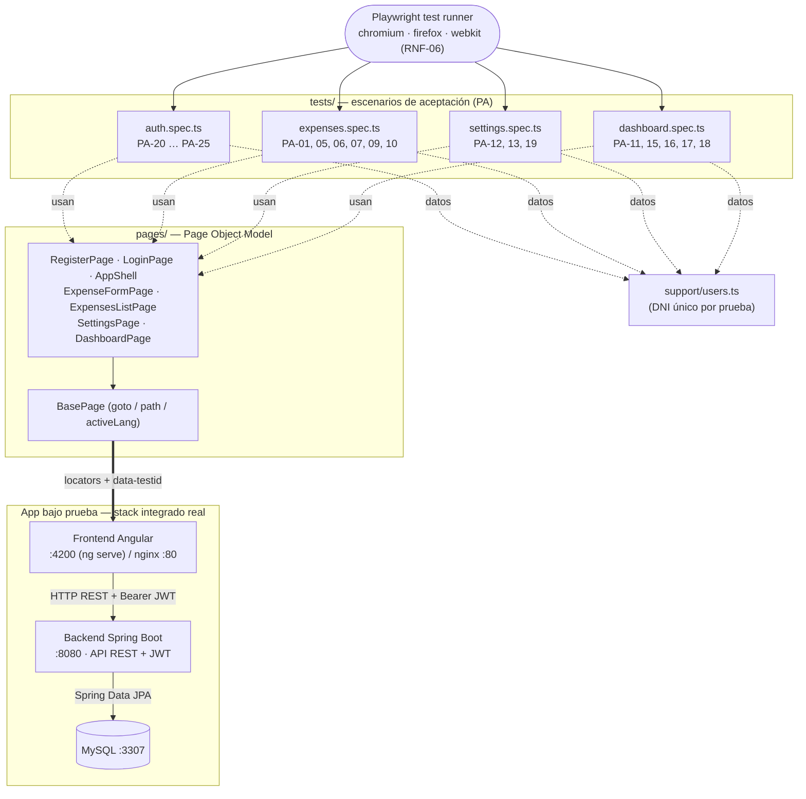

# Pruebas de aceptación (funcionales) — E2E con Playwright + Page Object Model

Este documento cubre las **pruebas de aceptación (PA-01 … PA-25)** de la tabla
*RESULTADOS DE PRUEBAS DE ACEPTACIÓN* del informe: qué **historia de usuario (HU)**
valida cada una, **dónde está la prueba en el código**, con qué **patrón** y qué
**tecnología** se usa. Complementa las pruebas de componente del backend
([`PRUEBAS-BACKEND.md`](PRUEBAS-BACKEND.md)) llevando cada criterio hasta un
**navegador real** sobre el stack integrado.

---

## 0. Tecnología y patrón

| Aspecto | Elección | Por qué |
|---|---|---|
| **Framework de pruebas** | **Playwright Test** (`@playwright/test`) | Corre las PA en un **navegador real**, no simulado. |
| **Lenguaje** | **TypeScript** | Mismo lenguaje del frontend Angular; tipado en los Page Objects. |
| **Patrón de diseño** | **Page Object Model (POM)** | Los selectores e interacciones viven en `pages/`; los `tests/` describen el *escenario* sin tocar el DOM. |
| **Navegadores** | **Chromium, Firefox, WebKit** (3 proyectos) | Cubre **RNF-06** (Chrome/Edge = Chromium, Firefox, Safari = WebKit). |
| **Alcance** | End-to-end sobre el **stack integrado** | Angular + backend Spring Boot + MySQL corriendo de verdad. |
| **Datos de prueba** | DNI único por escenario (`support/users.ts`) | Cada PA es **independiente y re-ejecutable** aunque el backend persista datos. |
| **Aislamiento externo** | `page.route(...)` mockea `GET /api/exchange-rate` en el dashboard | Pruebas **deterministas**, sin depender de la API de terceros. |

**Ubicación de todo el suite**: [`frontend/e2e/`](frontend/e2e/)

```
e2e/
  tests/    ← specs por área funcional, nombradas por PA (los escenarios)
  pages/    ← Page Objects: BasePage + una clase por pantalla (el patrón POM)
  support/  ← utilidades (generación de usuarios únicos)
frontend/playwright.config.ts   ← baseURL, 3 navegadores, ejecución en serie
```

---

## 1. Diagrama: cómo se estructuran las pruebas de aceptación

El patrón **Page Object Model** separa **qué se prueba** (los specs, escenarios PA)
de **cómo se interactúa con la app** (los Page Objects). Los specs nunca tocan el
DOM directamente: llaman métodos legibles de los Page Objects, que a su vez
manejan los `locators` contra la app real.


<sub>Versión en texto (Mermaid), por si el PNG no carga:</sub>



> Fuente PlantUML (mismo formato que los demás diagramas del repo):
> [`docs/acceptance-e2e-diagram.puml`](docs/acceptance-e2e-diagram.puml).
> Para generar el PNG: ejecuta [`docs/render-diagrams.bat`](docs/render-diagrams.bat)
> (detecta el `.puml` nuevo automáticamente) → produce `docs/acceptance-e2e-diagram.png`.

---

## 2. El patrón en el código — Page Objects

Cada pantalla es una clase que **extiende `BasePage`**, declara sus `locators` y
expone **métodos de acción** legibles (`register(user)`, `login(dni, pw)`,
`create(expense)`, `setIncome(n)`, `selectLanguage(code)`…). Así el escenario de la
PA se lee como lenguaje natural.

| Page Object | Pantalla / ruta | HU | Métodos clave | Archivo |
|---|---|---|---|---|
| `BasePage` | — (base común) | — | `goto`, `path`, `activeLang`, `toast` | [pages/base.page.ts](frontend/e2e/pages/base.page.ts) |
| `RegisterPage` | `/register` | HU-13 | `open`, `register(user)` | [pages/register.page.ts](frontend/e2e/pages/register.page.ts) |
| `LoginPage` | `/login` | HU-14 | `open`, `login(dni, pw)` | [pages/login.page.ts](frontend/e2e/pages/login.page.ts) |
| `AppShell` | cabecera autenticada | HU-12, HU-15 | `logout`, `selectLanguage(code)` | [pages/app-shell.page.ts](frontend/e2e/pages/app-shell.page.ts) |
| `ExpenseFormPage` | `/expenses/new` · `/…/edit` | HU-01, HU-04, HU-05 | `create`, `deleteExpense`, `openDeleteThenCancel` | [pages/expense-form.page.ts](frontend/e2e/pages/expense-form.page.ts) |
| `ExpensesListPage` | `/expenses` | HU-02, HU-03 | `item`, `openItem`, `filterByDateTo` | [pages/expenses-list.page.ts](frontend/e2e/pages/expenses-list.page.ts) |
| `SettingsPage` | `/settings` | HU-06/07/08 | `setIncome`, `saveAndWait`, `saveSettings` | [pages/settings.page.ts](frontend/e2e/pages/settings.page.ts) |
| `DashboardPage` | `/dashboard` | HU-09/10/11 | `budgetStatus`, `budgetLevel`, `categoryBreakdown` | [pages/dashboard.page.ts](frontend/e2e/pages/dashboard.page.ts) |

> Selección estable: la app expone atributos **`data-testid`** (`logout`,
> `lang-select`, `budget-status` + `data-level`, `confirm-dialog/-accept/-cancel`,
> `form-error`, `income-error`, `expense-delete`, `expenses-no-results`) para que los
> Page Objects no dependan de textos ni estilos.

---

## 3. Listado TABLE VI — PA → HU → criterio → dónde está la prueba

Las **20 PA** que son flujo de interfaz se verifican en E2E (Playwright + POM). Las
**5 restantes** (validaciones y cálculos puros) se verifican a nivel unitario; se
listan igual con su ubicación (ver §4).

| ID | Historia de usuario | Criterio de aceptación | Estado | Prueba (`test(...)`) | Ubicación |
|---|---|---|:--:|---|---|
| PA-01 | HU-01 Registro gasto | Registro exitoso de gasto | ✅ | `PA-01: registrar un gasto exitosamente` | [expenses.spec.ts:19](frontend/e2e/tests/expenses.spec.ts#L19) |
| PA-02 | HU-01 Registro gasto | Validación de campos obligatorios | ✅ | *(unitaria — §4)* | [DtoValidationTest.java:52](backend/src/test/java/com/gastos/dto/DtoValidationTest.java#L52) |
| PA-03 | HU-01 Registro gasto | Validación de monto mayor a cero | ✅ | *(unitaria — §4)* | [DtoValidationTest.java:63](backend/src/test/java/com/gastos/dto/DtoValidationTest.java#L63) |
| PA-04 | HU-02 Consultar gastos | Visualización de gastos | ✅ | *(unitaria — §4)* | [ExpenseServiceTest.java:124](backend/src/test/java/com/gastos/service/ExpenseServiceTest.java#L124) |
| PA-05 | HU-03 Filtrar gastos | Filtrado por categoría, moneda o fechas | ✅ | `PA-05 / PA-06: filtrar por fecha` | [expenses.spec.ts:27](frontend/e2e/tests/expenses.spec.ts#L27) |
| PA-06 | HU-03 Filtrar gastos | Cuando no existen resultados | ✅ | `PA-05 / PA-06: filtrar por fecha` | [expenses.spec.ts:27](frontend/e2e/tests/expenses.spec.ts#L27) |
| PA-07 | HU-04 Editar gasto | Actualización correcta de un gasto | ✅ | `PA-07: editar un gasto` | [expenses.spec.ts:40](frontend/e2e/tests/expenses.spec.ts#L40) |
| PA-08 | HU-04 Editar gasto | Validación de datos inválidos | ✅ | *(unitaria — §4)* | [DtoValidationTest.java:76](backend/src/test/java/com/gastos/dto/DtoValidationTest.java#L76) |
| PA-09 | HU-05 Eliminar gasto | Eliminación confirmada de gasto | ✅ | `PA-09: eliminar un gasto (confirmando)` | [expenses.spec.ts:56](frontend/e2e/tests/expenses.spec.ts#L56) |
| PA-10 | HU-05 Eliminar gasto | Cancelación de eliminación | ✅ | `PA-10: cancelar la eliminación deja el gasto intacto` | [expenses.spec.ts:68](frontend/e2e/tests/expenses.spec.ts#L68) |
| PA-11 | HU-06 Consultar configuración financiera | Visualización de ingreso mensual y alertas | ✅ | `PA-17 / PA-18: …presupuesto` (badge visible) | [dashboard.spec.ts:25](frontend/e2e/tests/dashboard.spec.ts#L25) |
| PA-12 | HU-07 Actualizar ingreso mensual | Actualización correcta del ingreso mensual | ✅ | `PA-12: actualizar el ingreso mensual y que persista` | [settings.spec.ts:19](frontend/e2e/tests/settings.spec.ts#L19) |
| PA-13 | HU-07 Actualizar ingreso mensual | Validación de monto inválido | ✅ | `PA-13: un ingreso negativo muestra error` | [settings.spec.ts:30](frontend/e2e/tests/settings.spec.ts#L30) |
| PA-14 | HU-08 Configurar alertas | Actualización del estado de alertas | ✅ | *(unitaria — §4)* | [SettingsServiceTest.java:116](backend/src/test/java/com/gastos/service/SettingsServiceTest.java#L116) |
| PA-15 | HU-09 Consultar distribución por categorías | Visualización de distribución porcentual | ✅ | `PA-15 / PA-16: distribución y recientes` | [dashboard.spec.ts:41](frontend/e2e/tests/dashboard.spec.ts#L41) |
| PA-16 | HU-10 Consultar gastos recientes | Visualización de gastos recientes | ✅ | `PA-15 / PA-16: distribución y recientes` | [dashboard.spec.ts:41](frontend/e2e/tests/dashboard.spec.ts#L41) |
| PA-17 | HU-11 Nivel de presupuesto consumido | Cálculo del porcentaje de presupuesto utilizado | ✅ | `PA-17 / PA-18: porcentaje y nivel` | [dashboard.spec.ts:25](frontend/e2e/tests/dashboard.spec.ts#L25) |
| PA-18 | HU-11 Nivel de presupuesto consumido | Niveles OK, INFO, WARNING y DANGER | ✅ | `PA-17 / PA-18: porcentaje y nivel` | [dashboard.spec.ts:25](frontend/e2e/tests/dashboard.spec.ts#L25) |
| PA-19 | HU-12 Cambiar idioma | Cambio correcto de idioma de la interfaz | ✅ | `PA-19: cambiar el idioma de la interfaz` | [settings.spec.ts:39](frontend/e2e/tests/settings.spec.ts#L39) |
| PA-20 | HU-13 Registrar usuario | Registro exitoso de usuario | ✅ | `PA-20: registro exitoso de usuario` | [auth.spec.ts:12](frontend/e2e/tests/auth.spec.ts#L12) |
| PA-21 | HU-13 Registrar usuario | Validación de DNI ya registrado | ✅ | `PA-21: registrar un DNI ya registrado muestra error` | [auth.spec.ts:21](frontend/e2e/tests/auth.spec.ts#L21) |
| PA-22 | HU-14 Iniciar sesión | Inicio de sesión con credenciales válidas | ✅ | `PA-22: inicio de sesión con credenciales válidas` | [auth.spec.ts:39](frontend/e2e/tests/auth.spec.ts#L39) |
| PA-23 | HU-14 Iniciar sesión | Mensaje de error ante credenciales inválidas | ✅ | `PA-23: credenciales inválidas muestran mensaje` | [auth.spec.ts:53](frontend/e2e/tests/auth.spec.ts#L53) |
| PA-24 | HU-15 Cerrar sesión | Finalización correcta de sesión | ✅ | `PA-24: cierre de sesión correcto` | [auth.spec.ts:62](frontend/e2e/tests/auth.spec.ts#L62) |
| PA-25 | HU-15 Cerrar sesión | Restricción de acceso a rutas protegidas tras cerrar sesión | ✅ | `PA-25: tras cerrar sesión no se accede a rutas protegidas` | [auth.spec.ts:72](frontend/e2e/tests/auth.spec.ts#L72) |

**Resultado E2E**: 20 escenarios PA × 3 navegadores = **60 corridas verde**.

---

## 4. Las 5 PA verificadas a nivel unitario (no E2E)

Son validaciones de entrada y cálculos puros: se prueban de forma más barata y
precisa en unitarias (no necesitan navegador). Igual quedan **cubiertas**.

| ID | Criterio | Por qué unitaria | Ubicación |
|---|---|---|---|
| PA-02 | Campos obligatorios del gasto | Regla de **Bean Validation** del DTO | [DtoValidationTest.java:52](backend/src/test/java/com/gastos/dto/DtoValidationTest.java#L52) |
| PA-03 | Monto mayor a cero | Regla `@DecimalMin` del DTO | [DtoValidationTest.java:63](backend/src/test/java/com/gastos/dto/DtoValidationTest.java#L63) |
| PA-04 | Visualización de gastos del usuario | Lógica de `findAll` (servicio) | [ExpenseServiceTest.java:124](backend/src/test/java/com/gastos/service/ExpenseServiceTest.java#L124) |
| PA-08 | Datos inválidos al editar | Regla de validación de `ExpenseUpdateRequest` | [DtoValidationTest.java:76](backend/src/test/java/com/gastos/dto/DtoValidationTest.java#L76) |
| PA-14 | Estado de alertas | Regla de negocio de `SettingsService` (y `alerts.effects` en el front) | [SettingsServiceTest.java:116](backend/src/test/java/com/gastos/service/SettingsServiceTest.java#L116) |

> Nota: PA-11, PA-17 y PA-18 tienen **doble cobertura**: el cálculo puro se prueba
> en unitarias del frontend (`budget.spec.ts`, `budget.selectors.spec.ts`) y la
> **visualización** en el E2E del dashboard.

---

## 5. Cómo ejecutar

```bash
cd frontend
npm install               # instala @playwright/test (ya está en devDependencies)
npx playwright install    # descarga Chromium, Firefox y WebKit (una sola vez)

npm run e2e               # las 20 PA en los 3 navegadores (headless)
npm run e2e:ui            # modo interactivo (UI mode)
npx playwright test --project=chromium         # un solo navegador
npx playwright test e2e/tests/auth.spec.ts     # un solo archivo (HU-13/14/15)
npm run e2e:report        # abre el reporte HTML de la última corrida
```

**Requisitos** (stack integrado levantado):

1. **MySQL** (Docker, puerto **3307**).
2. **Backend** Spring Boot en `http://localhost:8080`.
3. **Frontend** en `http://localhost:4200` — Playwright lo arranca solo (`webServer`)
   o reúsa el que esté corriendo.

Contra el stack dockerizado: `E2E_BASE_URL=http://localhost npm run e2e`.
Detalle en [`frontend/e2e/README.md`](frontend/e2e/README.md).

---

## 6. Trazabilidad HU → PA → spec

| Historia de usuario | PA cubiertas | Spec E2E |
|---|---|---|
| HU-01 Registro gasto | PA-01 (E2E) · PA-02, PA-03 (unit) | [expenses.spec.ts](frontend/e2e/tests/expenses.spec.ts) |
| HU-02 Consultar gastos | PA-04 (unit) | — |
| HU-03 Filtrar gastos | PA-05, PA-06 | [expenses.spec.ts](frontend/e2e/tests/expenses.spec.ts) |
| HU-04 Editar gasto | PA-07 (E2E) · PA-08 (unit) | [expenses.spec.ts](frontend/e2e/tests/expenses.spec.ts) |
| HU-05 Eliminar gasto | PA-09, PA-10 | [expenses.spec.ts](frontend/e2e/tests/expenses.spec.ts) |
| HU-06 Consultar configuración | PA-11 | [dashboard.spec.ts](frontend/e2e/tests/dashboard.spec.ts) |
| HU-07 Actualizar ingreso | PA-12, PA-13 | [settings.spec.ts](frontend/e2e/tests/settings.spec.ts) |
| HU-08 Configurar alertas | PA-14 (unit) | — |
| HU-09 Distribución por categorías | PA-15 | [dashboard.spec.ts](frontend/e2e/tests/dashboard.spec.ts) |
| HU-10 Gastos recientes | PA-16 | [dashboard.spec.ts](frontend/e2e/tests/dashboard.spec.ts) |
| HU-11 Nivel de presupuesto | PA-17, PA-18 | [dashboard.spec.ts](frontend/e2e/tests/dashboard.spec.ts) |
| HU-12 Cambiar idioma | PA-19 | [settings.spec.ts](frontend/e2e/tests/settings.spec.ts) |
| HU-13 Registrar usuario | PA-20, PA-21 | [auth.spec.ts](frontend/e2e/tests/auth.spec.ts) |
| HU-14 Iniciar sesión | PA-22, PA-23 | [auth.spec.ts](frontend/e2e/tests/auth.spec.ts) |
| HU-15 Cerrar sesión | PA-24, PA-25 | [auth.spec.ts](frontend/e2e/tests/auth.spec.ts) |
