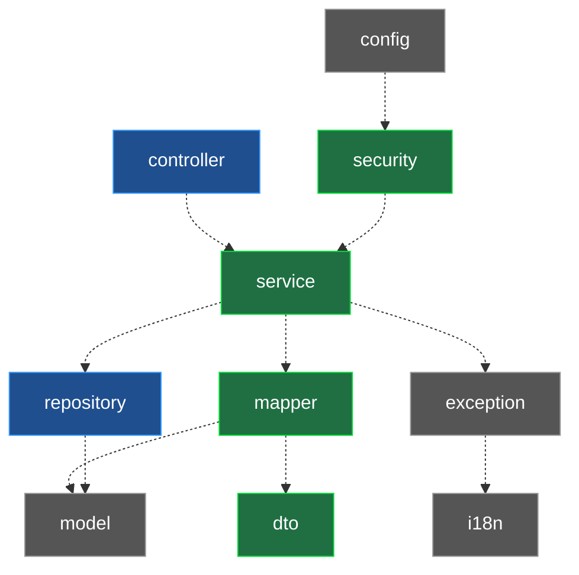

# Pruebas automatizadas

Este documento **parte de los diagramas de arquitectura del backend** (paquetes,
componentes y clases de dominio) y, para **cada componente y método** que aparece
en ellos, indica **qué prueba lo verifica y dónde está exactamente** (archivo +
línea). Es la unión de los tres artefactos que ya existen en el repo:

- Los **diagramas** en [`docs/`](docs/) (`.puml` + `.png` ya renderizados).
- La **especificación de métodos** de [paso 1](docs/paso1-inventario-metodos.md) y
  [paso 2](docs/paso2-especificacion-metodos.md).
- Las **pruebas** en [`backend/src/test/java/com/gastos/`](backend/src/test/java/com/gastos/).

---

## 0. Resumen

| Capa de prueba                                    | Tipo               | Archivos | Pruebas | Estado |
| ------------------------------------------------- | ------------------ | -------: | ------: | :----: |
| Unitarias (JUnit 5 + Mockito + AssertJ)           | aisladas con mocks |        9 |  **38** |   ✅    |
| Integración (`@SpringBootTest` + MockMvc + MySQL) | contexto real      |        5 |  **12** |   ✅    |
| **Total backend**                                 |                    |   **14** |  **50** |   ✅    |

Nomenclatura de trazabilidad con el informe: **TC-xx** (caso de prueba),
**PA-xx** (prueba de aceptación), **U** = unitaria, **I** = integración.

### Cómo ejecutar

```bash
# Todas las pruebas del backend
mvn -f backend/pom.xml test

# Solo unitarias de un componente (ejemplo)
mvn -f backend/pom.xml test -Dtest=ExpenseServiceTest

# Solo las de integración (paquete integration)
mvn -f backend/pom.xml test -Dtest="com.gastos.integration.*"
```

Las pruebas de integración levantan el contexto de Spring y usan la base de datos;
requieren el MySQL del `docker-compose` (puerto **3307**) o el perfil de test configurado.

---

## 1. Diagrama de paquetes → qué capa se prueba y cómo


El diagrama muestra la **arquitectura por capas** de `com.gastos`. De ahí se decide
la **estrategia de prueba** por paquete:



<sub>🟩 unitarias · 🟦 integración · ⬛ soporte (se validan de forma indirecta)</sub>

| Paquete                                | Rol en la arquitectura                    | Estrategia de prueba                           | Dónde                                                        |
| -------------------------------------- | ----------------------------------------- | ---------------------------------------------- | ------------------------------------------------------------ |
| `service`                              | Lógica de negocio (núcleo)                | **Unitaria** — repos/mapper mockeados          | [`test/.../service/`](backend/src/test/java/com/gastos/service/) |
| `security`                             | Emisión/validación JWT y carga de usuario | **Unitaria**                                   | [`test/.../security/`](backend/src/test/java/com/gastos/security/) |
| `mapper`                               | Conversión entidad ↔ DTO                  | **Unitaria** (conversión pura)                 | [`test/.../mapper/`](backend/src/test/java/com/gastos/mapper/) |
| `dto`                                  | Reglas de validación (Bean Validation)    | **Unitaria** (Validator)                       | [`test/.../dto/`](backend/src/test/java/com/gastos/dto/)     |
| `controller`                           | API REST (entrada HTTP)                   | **Integración** — MockMvc                      | [`test/.../integration/`](backend/src/test/java/com/gastos/integration/) |
| `repository`                           | Acceso a datos (Spring Data JPA)          | **Integración** — se ejercita vía controllers  | [`test/.../integration/`](backend/src/test/java/com/gastos/integration/) |
| `model`, `exception`, `i18n`, `config` | Soporte / infraestructura                 | Indirecta (getters, handler de errores, beans) | —                                                            |

---

## 2. Diagrama de componentes → método → prueba


> cada componente aparece con **sus métodos, parámetros y retorno**. Las tablas de abajo
> toman **cada método del diagrama** y lo enlazan con la prueba que lo verifica.

### 2.1 Paquete `service` — pruebas **unitarias** (25 pruebas)

Aisladas con **Mockito** (`@Mock` repositorios y mapper, `@InjectMocks` el servicio)
y aserciones **AssertJ**. Son el núcleo de la suite.

#### `AuthService` → [`service/AuthServiceTest.java`](backend/src/test/java/com/gastos/service/AuthServiceTest.java)

| Método (del diagrama)       | Escenario                                            | Prueba (`@Test`)                  | Ubicación                                                    | Trazas        |
| --------------------------- | ---------------------------------------------------- | --------------------------------- | ------------------------------------------------------------ | ------------- |
| `register(RegisterRequest)` | encripta clave, normaliza opcionales, devuelve token | `tc13_pa20_register_ok`           | [AuthServiceTest.java:54](backend/src/test/java/com/gastos/service/AuthServiceTest.java#L54) | TC-13 / PA-20 |
| `register(RegisterRequest)` | DNI existente → `ConflictException`, no guarda       | `tc13_pa21_register_duplicateDni` | [AuthServiceTest.java:82](backend/src/test/java/com/gastos/service/AuthServiceTest.java#L82) | TC-13 / PA-21 |
| `login(LoginRequest)`       | credenciales válidas → token                         | `tc14_pa22_login_ok`              | [AuthServiceTest.java:96](backend/src/test/java/com/gastos/service/AuthServiceTest.java#L96) | TC-14 / PA-22 |
| `login(LoginRequest)`       | credenciales inválidas → `BadCredentialsException`   | `tc14_pa23_login_badCredentials`  | [AuthServiceTest.java:113](backend/src/test/java/com/gastos/service/AuthServiceTest.java#L113) | TC-14 / PA-23 |
| `me(String dni)`            | devuelve datos públicos del usuario                  | `tc15_pa24_me_ok`                 | [AuthServiceTest.java:127](backend/src/test/java/com/gastos/service/AuthServiceTest.java#L127) | TC-15 / PA-24 |
| `me(String dni)`            | DNI inexistente → `NotFoundException`                | `tc15_me_userNotFound`            | [AuthServiceTest.java:149](backend/src/test/java/com/gastos/service/AuthServiceTest.java#L149) | TC-15         |

#### `ExpenseService` → [`service/ExpenseServiceTest.java`](backend/src/test/java/com/gastos/service/ExpenseServiceTest.java)

| Método (del diagrama)         | Escenario                                         | Prueba (`@Test`)                      | Ubicación                                                    | Trazas        |
| ----------------------------- | ------------------------------------------------- | ------------------------------------- | ------------------------------------------------------------ | ------------- |
| `create(dni, ExpenseRequest)` | persiste con usuario y categoría resueltos        | `tc01_pa01_create_ok`                 | [ExpenseServiceTest.java:87](backend/src/test/java/com/gastos/service/ExpenseServiceTest.java#L87) | TC-01 / PA-01 |
| `create(dni, ExpenseRequest)` | categoría inexistente → `NotFoundException`       | `tc01_create_categoryNotFound`        | [ExpenseServiceTest.java:109](backend/src/test/java/com/gastos/service/ExpenseServiceTest.java#L109) | TC-01         |
| `findAll(dni, filtros…)`      | devuelve la lista del usuario                     | `tc02_pa04_findAll_list`              | [ExpenseServiceTest.java:124](backend/src/test/java/com/gastos/service/ExpenseServiceTest.java#L124) | TC-02 / PA-04 |
| `findAll(dni, filtros…)`      | delega filtros (categoría/moneda/fechas) al repo  | `tc03_pa05_findAll_withFilters`       | [ExpenseServiceTest.java:139](backend/src/test/java/com/gastos/service/ExpenseServiceTest.java#L139) | TC-03 / PA-05 |
| `findAll(dni, filtros…)`      | sin coincidencias → lista vacía                   | `tc03_pa06_findAll_empty`             | [ExpenseServiceTest.java:154](backend/src/test/java/com/gastos/service/ExpenseServiceTest.java#L154) | TC-03 / PA-06 |
| `update(dni, id, req)`        | aplica solo campos no-null                        | `tc04_pa07_update_onlyNonNullFields`  | [ExpenseServiceTest.java:164](backend/src/test/java/com/gastos/service/ExpenseServiceTest.java#L164) | TC-04 / PA-07 |
| `update(dni, id, req)`        | gasto ajeno → `NotFoundException` (multi-tenancy) | `tc04_update_foreignExpense_notFound` | [ExpenseServiceTest.java:183](backend/src/test/java/com/gastos/service/ExpenseServiceTest.java#L183) | TC-04         |
| `delete(dni, id)`             | gasto propio se elimina                           | `tc05_pa09_delete_own`                | [ExpenseServiceTest.java:196](backend/src/test/java/com/gastos/service/ExpenseServiceTest.java#L196) | TC-05 / PA-09 |
| `delete(dni, id)`             | gasto ajeno → `NotFoundException`, no borra       | `tc05_delete_foreign_notFound`        | [ExpenseServiceTest.java:207](backend/src/test/java/com/gastos/service/ExpenseServiceTest.java#L207) | TC-05         |

#### `SettingsService` → [`service/SettingsServiceTest.java`](backend/src/test/java/com/gastos/service/SettingsServiceTest.java)

| Método (del diagrama) | Escenario                                         | Prueba (`@Test`)                              | Ubicación                                                    | Trazas        |
| --------------------- | ------------------------------------------------- | --------------------------------------------- | ------------------------------------------------------------ | ------------- |
| `get(dni)`            | devuelve ingreso y alertas guardadas              | `tc06_pa11_get_existing`                      | [SettingsServiceTest.java:58](backend/src/test/java/com/gastos/service/SettingsServiceTest.java#L58) | TC-06 / PA-11 |
| `get(dni)`            | sin config previa → valores por defecto           | `tc06_get_defaults`                           | [SettingsServiceTest.java:70](backend/src/test/java/com/gastos/service/SettingsServiceTest.java#L70) | TC-06         |
| `update(dni, req)`    | crea la config y guarda el ingreso si no existía  | `tc07_pa12_update_createsAndSavesIncome`      | [SettingsServiceTest.java:86](backend/src/test/java/com/gastos/service/SettingsServiceTest.java#L86) | TC-07 / PA-12 |
| `update(dni, req)`    | usuario inexistente → `NotFoundException`         | `tc07_update_userNotFound`                    | [SettingsServiceTest.java:101](backend/src/test/java/com/gastos/service/SettingsServiceTest.java#L101) | TC-07         |
| `update(dni, req)`    | cambia alertas; `fontScale` null cae a `"normal"` | `tc08_pa14_update_alertsAndFontScaleFallback` | [SettingsServiceTest.java:116](backend/src/test/java/com/gastos/service/SettingsServiceTest.java#L116) | TC-08 / PA-14 |

#### `CategoryService` → [`service/CategoryServiceTest.java`](backend/src/test/java/com/gastos/service/CategoryServiceTest.java)

| Método (del diagrama) | Escenario                                  | Prueba (`@Test`)       | Ubicación                                                    | Trazas        |
| --------------------- | ------------------------------------------ | ---------------------- | ------------------------------------------------------------ | ------------- |
| `findAll()`           | mapea categorías ordenadas por `sortOrder` | `tc16_pa25_findAll_ok` | [CategoryServiceTest.java:44](backend/src/test/java/com/gastos/service/CategoryServiceTest.java#L44) | TC-16 / PA-25 |
| `findAll()`           | sin categorías → lista vacía               | `tc16_findAll_empty`   | [CategoryServiceTest.java:62](backend/src/test/java/com/gastos/service/CategoryServiceTest.java#L62) | TC-16         |

#### `ExchangeRateService` → [`service/ExchangeRateServiceTest.java`](backend/src/test/java/com/gastos/service/ExchangeRateServiceTest.java)

| Método (del diagrama) | Escenario                                         | Prueba (`@Test`)           | Ubicación                                                    | Trazas        |
| --------------------- | ------------------------------------------------- | -------------------------- | ------------------------------------------------------------ | ------------- |
| `getUsdToPen()`       | devuelve el valor PEN que reporta la API          | `tc19_pa30_getRate_ok`     | [ExchangeRateServiceTest.java:79](backend/src/test/java/com/gastos/service/ExchangeRateServiceTest.java#L79) | TC-19 / PA-30 |
| `getUsdToPen()`       | segunda llamada usa la caché (no repega a la API) | `tc19_pa31_getRate_cached` | [ExchangeRateServiceTest.java:93](backend/src/test/java/com/gastos/service/ExchangeRateServiceTest.java#L93) | TC-19 / PA-31 |
| `getUsdToPen()`       | API caída y sin caché → `503 ServiceUnavailable`  | `tc19_getRate_unavailable` | [ExchangeRateServiceTest.java:110](backend/src/test/java/com/gastos/service/ExchangeRateServiceTest.java#L110) | TC-19         |

### 2.2 Paquete `security` — pruebas **unitarias** (6 pruebas)

#### `JwtService` → [`security/JwtServiceTest.java`](backend/src/test/java/com/gastos/security/JwtServiceTest.java)

| Método (del diagrama)          | Escenario                                          | Prueba (`@Test`)        | Ubicación                                                    |
| ------------------------------ | -------------------------------------------------- | ----------------------- | ------------------------------------------------------------ |
| `generateToken` + `extractDni` | round-trip: recupera el mismo DNI                  | `roundTrip`             | [JwtServiceTest.java:27](backend/src/test/java/com/gastos/security/JwtServiceTest.java#L27) |
| `isTokenValid(token, dni)`     | true para DNI correcto, false para otro            | `validForMatchingDni`   | [JwtServiceTest.java:36](backend/src/test/java/com/gastos/security/JwtServiceTest.java#L36) |
| `isTokenValid(token, dni)`     | token expirado es rechazado (`JwtException`)       | `expiredTokenRejected`  | [JwtServiceTest.java:46](backend/src/test/java/com/gastos/security/JwtServiceTest.java#L46) |
| `extractDni(token)`            | token manipulado (firma inválida) → `JwtException` | `tamperedTokenRejected` | [JwtServiceTest.java:56](backend/src/test/java/com/gastos/security/JwtServiceTest.java#L56) |

#### `CustomUserDetailsService` → [`security/CustomUserDetailsServiceTest.java`](backend/src/test/java/com/gastos/security/CustomUserDetailsServiceTest.java)

| Método (del diagrama)     | Escenario                                     | Prueba (`@Test`)         | Ubicación                                                    | Trazas        |
| ------------------------- | --------------------------------------------- | ------------------------ | ------------------------------------------------------------ | ------------- |
| `loadUserByUsername(dni)` | mapea DNI, password y autoridad `ROLE_USER`   | `tc18_pa29_loadUser_ok`  | [CustomUserDetailsServiceTest.java:41](backend/src/test/java/com/gastos/security/CustomUserDetailsServiceTest.java#L41) | TC-18 / PA-29 |
| `loadUserByUsername(dni)` | DNI inexistente → `UsernameNotFoundException` | `tc18_loadUser_notFound` | [CustomUserDetailsServiceTest.java:57](backend/src/test/java/com/gastos/security/CustomUserDetailsServiceTest.java#L57) | TC-18         |

> `JwtAuthenticationFilter` (también en el paquete `security` del diagrama) no se
> prueba de forma aislada: su comportamiento se verifica **en integración** cuando
> cada endpoint protegido responde 200 con token y 401/403 sin él.

### 2.3 Paquete `mapper` — pruebas **unitarias** (3 pruebas)

#### `ExpenseMapper` → [`mapper/ExpenseMapperTest.java`](backend/src/test/java/com/gastos/mapper/ExpenseMapperTest.java)

| Método (del diagrama)      | Escenario                                          | Prueba (`@Test`)                | Ubicación                                                    | Trazas        |
| -------------------------- | -------------------------------------------------- | ------------------------------- | ------------------------------------------------------------ | ------------- |
| `toResponse(Expense)`      | copia campos y aplana `category.id` → `categoryId` | `tc17_pa26_toResponse_expense`  | [ExpenseMapperTest.java:31](backend/src/test/java/com/gastos/mapper/ExpenseMapperTest.java#L31) | TC-17 / PA-26 |
| `toEntity(req, cat, user)` | copia el request y asigna categoría y dueño        | `tc17_pa27_toEntity`            | [ExpenseMapperTest.java:64](backend/src/test/java/com/gastos/mapper/ExpenseMapperTest.java#L64) | TC-17 / PA-27 |
| `toResponse(Category)`     | mapea id, name, icon y description                 | `tc17_pa28_toResponse_category` | [ExpenseMapperTest.java:86](backend/src/test/java/com/gastos/mapper/ExpenseMapperTest.java#L86) | TC-17 / PA-28 |

### 2.4 Paquete `dto` — pruebas **unitarias** de validación (4 pruebas)

Verifican las anotaciones **Bean Validation** de los DTOs de entrada usando un
`Validator` estándar (sin Spring).

#### `DtoValidationTest` → [`dto/DtoValidationTest.java`](backend/src/test/java/com/gastos/dto/DtoValidationTest.java)

| DTO (del diagrama de clases/dto) | Escenario                                              | Prueba (`@Test`)                                       | Ubicación                                                    | Trazas |
| -------------------------------- | ------------------------------------------------------ | ------------------------------------------------------ | ------------------------------------------------------------ | ------ |
| `ExpenseRequest`                 | todo nulo → viola los 5 campos obligatorios            | `pa02_expenseRequest_requiredFields`                   | [DtoValidationTest.java:52](backend/src/test/java/com/gastos/dto/DtoValidationTest.java#L52) | PA-02  |
| `ExpenseRequest`                 | monto 0 viola el mínimo; monto válido no               | `pa03_expenseRequest_amountMin`                        | [DtoValidationTest.java:63](backend/src/test/java/com/gastos/dto/DtoValidationTest.java#L63) | PA-03  |
| `ExpenseUpdateRequest`           | monto<0.1 y descripción>80 violan; todo null es válido | `pa08_expenseUpdateRequest_invalidData`                | [DtoValidationTest.java:76](backend/src/test/java/com/gastos/dto/DtoValidationTest.java#L76) | PA-08  |
| `SettingsUpdateRequest`          | ingreso negativo y `fontScale` inválido violan         | `pa13_settingsUpdateRequest_invalidIncomeAndFontScale` | [DtoValidationTest.java:89](backend/src/test/java/com/gastos/dto/DtoValidationTest.java#L89) | PA-13  |

---

## 3. Diagrama de clases (dominio) → dónde se ejercita


Las entidades `User`, `Expense`, `Category`, `UserSettings` y el enum `Currency`
son en su mayoría **getters/setters** (no llevan prueba unitaria propia). Se
ejercitan de forma indirecta:

| Entidad / enum                                 | Se ejercita en                                      | Cómo                                       |
| ---------------------------------------------- | --------------------------------------------------- | ------------------------------------------ |
| `Expense` ↔ `ExpenseResponse`                  | `ExpenseMapperTest` (U)                             | conversión entidad↔DTO                     |
| `Category` ↔ `CategoryResponse`                | `ExpenseMapperTest` (U)                             | conversión entidad↔DTO                     |
| `User` (persistencia + relación con `Expense`) | `AuthIntegrationTest`, `ExpenseIntegrationTest` (I) | alta/consulta reales en MySQL              |
| `UserSettings` (relación `User 1—0..1`)        | `SettingsIntegrationTest` (I)                       | crea/actualiza config con contexto real    |
| `Currency` (PEN/USD)                           | `ExpenseServiceTest`, `DtoValidationTest`           | se usa como valor de gasto y en validación |

---

## 4. Pruebas de integración (capa `controller` + `repository`)

Estas pruebas cierran el flujo del diagrama de componentes que **no** cubren las
unitarias: la entrada HTTP (`controller`), el filtro JWT (`security`) y el acceso
real a datos (`repository` → MySQL). Usan `@SpringBootTest` + `MockMvc` +
`@Transactional` (rollback por test).

#### `AuthController` + repos → [`integration/AuthIntegrationTest.java`](backend/src/test/java/com/gastos/integration/AuthIntegrationTest.java)

| Endpoint                  | Escenario                                 | Prueba (`@Test`)                | Ubicación                                                    |
| ------------------------- | ----------------------------------------- | ------------------------------- | ------------------------------------------------------------ |
| `POST /api/auth/register` | registra usuario y persiste (201 + token) | `shouldRegisterUser`            | [AuthIntegrationTest.java:43](backend/src/test/java/com/gastos/integration/AuthIntegrationTest.java#L43) |
| `POST /api/auth/login`    | login válido (200 + token)                | `shouldLoginSuccessfully`       | [AuthIntegrationTest.java:70](backend/src/test/java/com/gastos/integration/AuthIntegrationTest.java#L70) |
| `GET /api/auth/me`        | con Bearer JWT devuelve el usuario        | `shouldReturnAuthenticatedUser` | [AuthIntegrationTest.java:92](backend/src/test/java/com/gastos/integration/AuthIntegrationTest.java#L92) |

#### `ExpenseController` + repos → [`integration/ExpenseIntegrationTest.java`](backend/src/test/java/com/gastos/integration/ExpenseIntegrationTest.java)

| Endpoint                    | Escenario                        | Prueba (`@Test`)               | Ubicación                                                    |
| --------------------------- | -------------------------------- | ------------------------------ | ------------------------------------------------------------ |
| `POST /api/expenses`        | crea gasto autenticado (201)     | `shouldCreateExpense`          | [ExpenseIntegrationTest.java:59](backend/src/test/java/com/gastos/integration/ExpenseIntegrationTest.java#L59) |
| `GET /api/expenses`         | lista gastos del usuario (array) | `shouldListExpenses`           | [ExpenseIntegrationTest.java:79](backend/src/test/java/com/gastos/integration/ExpenseIntegrationTest.java#L79) |
| `PATCH /api/expenses/{id}`  | actualización parcial (200)      | `shouldUpdateExpensePartially` | [ExpenseIntegrationTest.java:87](backend/src/test/java/com/gastos/integration/ExpenseIntegrationTest.java#L87) |
| `DELETE /api/expenses/{id}` | elimina gasto propio (204)       | `shouldDeleteExpense`          | [ExpenseIntegrationTest.java:123](backend/src/test/java/com/gastos/integration/ExpenseIntegrationTest.java#L123) |

#### `SettingsController` + repos → [`integration/SettingsIntegrationTest.java`](backend/src/test/java/com/gastos/integration/SettingsIntegrationTest.java)

| Endpoint            | Escenario                         | Prueba (`@Test`)                               | Ubicación                                                    |
| ------------------- | --------------------------------- | ---------------------------------------------- | ------------------------------------------------------------ |
| `GET /api/settings` | sin config previa → defaults      | `shouldReturnDefaultSettingsWhenNotConfigured` | [SettingsIntegrationTest.java:59](backend/src/test/java/com/gastos/integration/SettingsIntegrationTest.java#L59) |
| `PUT /api/settings` | crea/actualiza config (200)       | `shouldCreateOrUpdateSettings`                 | [SettingsIntegrationTest.java:73](backend/src/test/java/com/gastos/integration/SettingsIntegrationTest.java#L73) |
| `PUT /api/settings` | actualiza una config ya existente | `shouldUpdateExistingSettings`                 | [SettingsIntegrationTest.java:96](backend/src/test/java/com/gastos/integration/SettingsIntegrationTest.java#L96) |

#### `CategoryController` → [`integration/CategoryIntegrationTest.java`](backend/src/test/java/com/gastos/integration/CategoryIntegrationTest.java)

| Endpoint              | Escenario                                         | Prueba (`@Test`)                                 | Ubicación                                                    |
| --------------------- | ------------------------------------------------- | ------------------------------------------------ | ------------------------------------------------------------ |
| `GET /api/categories` | 9 categorías sembradas, ordenadas por `sortOrder` | `shouldReturnSeededCategoriesOrderedBySortOrder` | [CategoryIntegrationTest.java:22](backend/src/test/java/com/gastos/integration/CategoryIntegrationTest.java#L22) |

#### `ExchangeRateController` → [`integration/ExchangeRateIntegrationTest.java`](backend/src/test/java/com/gastos/integration/ExchangeRateIntegrationTest.java)

| Endpoint                 | Escenario                        | Prueba (`@Test`)           | Ubicación                                                    |
| ------------------------ | -------------------------------- | -------------------------- | ------------------------------------------------------------ |
| `GET /api/exchange-rate` | devuelve `rate` numérico en JSON | `shouldReturnExchangeRate` | [ExchangeRateIntegrationTest.java:19](backend/src/test/java/com/gastos/integration/ExchangeRateIntegrationTest.java#L19) |

---

## 5. Matriz de trazabilidad: diagrama → componente → archivo de prueba

| Paquete (diagrama)          | Componente               | Tipo | Archivo de prueba                                            | Pruebas |
| --------------------------- | ------------------------ | :--: | ------------------------------------------------------------ | ------: |
| `service`                   | AuthService              |  U   | [service/AuthServiceTest.java](backend/src/test/java/com/gastos/service/AuthServiceTest.java) |       6 |
| `service`                   | ExpenseService           |  U   | [service/ExpenseServiceTest.java](backend/src/test/java/com/gastos/service/ExpenseServiceTest.java) |       9 |
| `service`                   | SettingsService          |  U   | [service/SettingsServiceTest.java](backend/src/test/java/com/gastos/service/SettingsServiceTest.java) |       5 |
| `service`                   | CategoryService          |  U   | [service/CategoryServiceTest.java](backend/src/test/java/com/gastos/service/CategoryServiceTest.java) |       2 |
| `service`                   | ExchangeRateService      |  U   | [service/ExchangeRateServiceTest.java](backend/src/test/java/com/gastos/service/ExchangeRateServiceTest.java) |       3 |
| `security`                  | JwtService               |  U   | [security/JwtServiceTest.java](backend/src/test/java/com/gastos/security/JwtServiceTest.java) |       4 |
| `security`                  | CustomUserDetailsService |  U   | [security/CustomUserDetailsServiceTest.java](backend/src/test/java/com/gastos/security/CustomUserDetailsServiceTest.java) |       2 |
| `mapper`                    | ExpenseMapper            |  U   | [mapper/ExpenseMapperTest.java](backend/src/test/java/com/gastos/mapper/ExpenseMapperTest.java) |       3 |
| `dto`                       | *(validación)*           |  U   | [dto/DtoValidationTest.java](backend/src/test/java/com/gastos/dto/DtoValidationTest.java) |       4 |
| `controller` + `repository` | AuthController           |  I   | [integration/AuthIntegrationTest.java](backend/src/test/java/com/gastos/integration/AuthIntegrationTest.java) |       3 |
| `controller` + `repository` | ExpenseController        |  I   | [integration/ExpenseIntegrationTest.java](backend/src/test/java/com/gastos/integration/ExpenseIntegrationTest.java) |       4 |
| `controller` + `repository` | SettingsController       |  I   | [integration/SettingsIntegrationTest.java](backend/src/test/java/com/gastos/integration/SettingsIntegrationTest.java) |       3 |
| `controller`                | CategoryController       |  I   | [integration/CategoryIntegrationTest.java](backend/src/test/java/com/gastos/integration/CategoryIntegrationTest.java) |       1 |
| `controller`                | ExchangeRateController   |  I   | [integration/ExchangeRateIntegrationTest.java](backend/src/test/java/com/gastos/integration/ExchangeRateIntegrationTest.java) |       1 |
|                             |                          |      | **Total**                                                    |  **50** |

